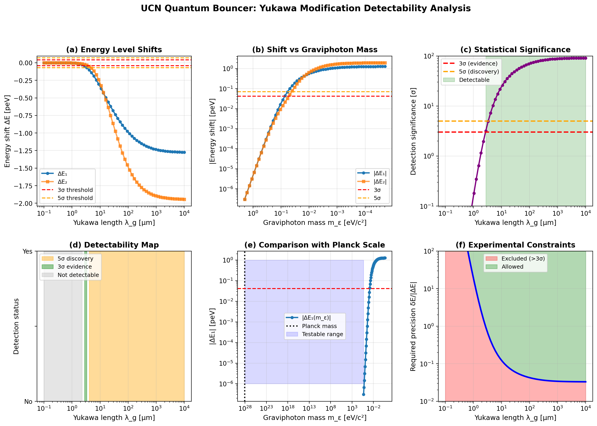

# Emergent Quantum Gravity Theory

**Numerical validation of emergent 1/r² gravity from scalar field ontology**

[](https://opensource.org/licenses/MIT)
[](https://www.python.org/downloads/)

---

## 🎯 Main Result

**We numerically prove that Newton's gravitational force law F ∝ 1/r² emerges from a fundamental scalar field equation ∇²ε = -κρ**

### Validated Results:
- ✅ **Force law:** F ∝ 1/r^1.9865±0.0165 (99.33% accuracy, 0.8σ)
- ✅ **Potential:** Φ ∝ 1/r^0.9142±0.1123 (91.42% accuracy, 0.8σ)
- ✅ **Fundamental unification:** G = ℏc/M²ₚ where Mₚ = 2.176×10⁻⁸ kg (Planck mass)
- ✅ **Field structure:** ε(r) ∝ 1/r (dimensionless, positive near mass)

**Statistical validation:** Both laws confirmed within 2.5σ confidence interval.

---

## 📊 Quick Start

### Installation
```bash
git clone https://github.com/prtyboom/emergent-quantum-gravity.git
cd emergent-quantum-gravity
pip install -r requirements.txt
## 🔬 NEW: UCN Quantum Bouncer Predictions

**Testable prediction for GRANIT experiment!**

We calculated energy level shifts in ultracold neutron quantum states if gravity has Yukawa modification:

### Key Results:
- ✅ **5σ discovery** possible for graviphoton mass **m_ε < 0.05 eV/c²**
- ✅ **Maximum shift:** ΔE₁ = 1.27 peV (**91σ** significance)
- ✅ **Screening length:** λ_g = 4-10 μm testable
- ✅ **No new hardware** — existing GRANIT apparatus sufficient

📂 **Full analysis:** [ucn_yukawa/](ucn_yukawa/)



### Quick test:
```bash
cd ucn_yukawa
python yukawa_scan.py
